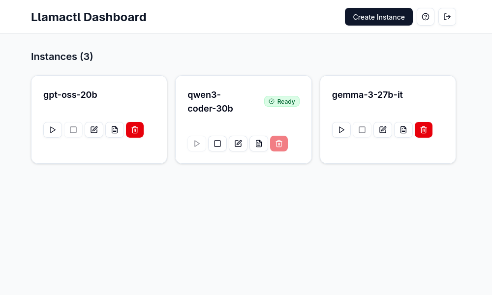

# llamactl

  

**Management server and proxy for multiple llama.cpp instances with OpenAI-compatible API routing.**

## Why llamactl?

🚀 **Multiple Model Serving**: Run different models simultaneously (7B for speed, 70B for quality)  
🔗 **OpenAI API Compatible**: Drop-in replacement - route requests by model name  
🌐 **Web Dashboard**: Modern React UI for visual management (unlike CLI-only tools)  
🔐 **API Key Authentication**: Separate keys for management vs inference access  
📊 **Instance Monitoring**: Health checks, auto-restart, log management  
⚡ **Persistent State**: Instances survive server restarts



**Choose llamactl if**: You need authentication, health monitoring, auto-restart, and centralized management of multiple llama-server instances  
**Choose Ollama if**: You want the simplest setup with strong community ecosystem and third-party integrations  
**Choose LM Studio if**: You prefer a polished desktop GUI experience with easy model management

## Quick Start

```bash
# 1. Install llama-server (one-time setup)
# See: https://github.com/ggml-org/llama.cpp#quick-start

# 2. Download and run llamactl
LATEST_VERSION=$(curl -s https://api.github.com/repos/lordmathis/llamactl/releases/latest | grep '"tag_name":' | sed -E 's/.*"([^"]+)".*/\1/')
curl -L https://github.com/lordmathis/llamactl/releases/download/${LATEST_VERSION}/llamactl-${LATEST_VERSION}-linux-amd64.tar.gz | tar -xz
sudo mv llamactl /usr/local/bin/

# 3. Start the server
llamactl
# Access dashboard at http://localhost:8080
```

## Usage

### Create and manage instances via web dashboard:
1. Open http://localhost:8080
2. Click "Create Instance"
3. Set model path and GPU layers
4. Start or stop the instance

### Or use the REST API:
```bash
# Create instance
curl -X POST localhost:8080/api/v1/instances/my-7b-model \
  -H "Authorization: Bearer your-key" \
  -d '{"model": "/path/to/model.gguf", "gpu_layers": 32}'

# Use with OpenAI SDK
curl -X POST localhost:8080/v1/chat/completions \
  -H "Authorization: Bearer your-key" \
  -d '{"model": "my-7b-model", "messages": [{"role": "user", "content": "Hello!"}]}'
```

## Installation

### Option 1: Download Binary (Recommended)

```bash
# Linux/macOS - Get latest version and download
LATEST_VERSION=$(curl -s https://api.github.com/repos/lordmathis/llamactl/releases/latest | grep '"tag_name":' | sed -E 's/.*"([^"]+)".*/\1/')
curl -L https://github.com/lordmathis/llamactl/releases/download/${LATEST_VERSION}/llamactl-${LATEST_VERSION}-$(uname -s | tr '[:upper:]' '[:lower:]')-$(uname -m).tar.gz | tar -xz
sudo mv llamactl /usr/local/bin/

# Or download manually from the releases page:
# https://github.com/lordmathis/llamactl/releases/latest

# Windows - Download from releases page
```

### Option 2: Build from Source
Requires Go 1.24+ and Node.js 22+
```bash
git clone https://github.com/lordmathis/llamactl.git
cd llamactl
cd webui && npm ci && npm run build && cd ..
go build -o llamactl ./cmd/server
```

## Prerequisites

You need `llama-server` from [llama.cpp](https://github.com/ggml-org/llama.cpp) installed:

```bash
# Quick install methods:
# Homebrew (macOS)
brew install llama.cpp

# Or build from source - see llama.cpp docs
```

## Configuration

llamactl works out of the box with sensible defaults.

```yaml
server:
  host: "0.0.0.0"                # Server host to bind to
  port: 8080                     # Server port to bind to
  allowed_origins: ["*"]         # Allowed CORS origins (default: all)
  enable_swagger: false          # Enable Swagger UI for API docs

instances:
  port_range: [8000, 9000]       # Port range for instances
  data_dir: ~/.local/share/llamactl         # Data directory (platform-specific, see below)
  configs_dir: ~/.local/share/llamactl/instances  # Instance configs directory
  logs_dir: ~/.local/share/llamactl/logs    # Logs directory
  auto_create_dirs: true         # Auto-create data/config/logs dirs if missing
  max_instances: -1              # Max instances (-1 = unlimited)
  llama_executable: llama-server # Path to llama-server executable
  default_auto_restart: true     # Auto-restart new instances by default
  default_max_restarts: 3        # Max restarts for new instances
  default_restart_delay: 5       # Restart delay (seconds) for new instances

auth:
  require_inference_auth: true   # Require auth for inference endpoints
  inference_keys: []             # Keys for inference endpoints
  require_management_auth: true  # Require auth for management endpoints
  management_keys: []            # Keys for management endpoints
```

<details><summary><strong>Full Configuration Guide</strong></summary>

llamactl can be configured via configuration files or environment variables. Configuration is loaded in the following order of precedence:  

```
Defaults < Configuration file < Environment variables
```

### Configuration Files

#### Configuration File Locations

Configuration files are searched in the following locations (in order of precedence):

**Linux/macOS:**
- `./llamactl.yaml` or `./config.yaml` (current directory)
- `$HOME/.config/llamactl/config.yaml`
- `/etc/llamactl/config.yaml`

**Windows:**
- `./llamactl.yaml` or `./config.yaml` (current directory)
- `%APPDATA%\llamactl\config.yaml`
- `%USERPROFILE%\llamactl\config.yaml`
- `%PROGRAMDATA%\llamactl\config.yaml`

You can specify the path to config file with `LLAMACTL_CONFIG_PATH` environment variable.

### Configuration Options

#### Server Configuration

```yaml
server:
  host: "0.0.0.0"         # Server host to bind to (default: "0.0.0.0")
  port: 8080              # Server port to bind to (default: 8080)
  allowed_origins: ["*"]  # CORS allowed origins (default: ["*"])
  enable_swagger: false   # Enable Swagger UI (default: false)
```

**Environment Variables:**
- `LLAMACTL_HOST` - Server host
- `LLAMACTL_PORT` - Server port
- `LLAMACTL_ALLOWED_ORIGINS` - Comma-separated CORS origins
- `LLAMACTL_ENABLE_SWAGGER` - Enable Swagger UI (true/false)

#### Instance Configuration

```yaml
instances:
  port_range: [8000, 9000]           # Port range for instances (default: [8000, 9000])
  data_dir: "~/.local/share/llamactl" # Directory for all llamactl data (default varies by OS)
  configs_dir: "~/.local/share/llamactl/instances" # Directory for instance configs (default: data_dir/instances)
  logs_dir: "~/.local/share/llamactl/logs" # Directory for instance logs (default: data_dir/logs)
  auto_create_dirs: true             # Automatically create data/config/logs directories (default: true)
  max_instances: -1                  # Maximum instances (-1 = unlimited)
  llama_executable: "llama-server"   # Path to llama-server executable
  default_auto_restart: true         # Default auto-restart setting
  default_max_restarts: 3            # Default maximum restart attempts
  default_restart_delay: 5           # Default restart delay in seconds
```

**Environment Variables:**
- `LLAMACTL_INSTANCE_PORT_RANGE` - Port range (format: "8000-9000" or "8000,9000")
- `LLAMACTL_DATA_DIRECTORY` - Data directory path
- `LLAMACTL_INSTANCES_DIR` - Instance configs directory path
- `LLAMACTL_LOGS_DIR` - Log directory path
- `LLAMACTL_AUTO_CREATE_DATA_DIR` - Auto-create data/config/logs directories (true/false)
- `LLAMACTL_MAX_INSTANCES` - Maximum number of instances
- `LLAMACTL_LLAMA_EXECUTABLE` - Path to llama-server executable
- `LLAMACTL_DEFAULT_AUTO_RESTART` - Default auto-restart setting (true/false)
- `LLAMACTL_DEFAULT_MAX_RESTARTS` - Default maximum restarts
- `LLAMACTL_DEFAULT_RESTART_DELAY` - Default restart delay in seconds

#### Authentication Configuration

```yaml
auth:
  require_inference_auth: true           # Require API key for OpenAI endpoints (default: true)
  inference_keys: []                     # List of valid inference API keys
  require_management_auth: true          # Require API key for management endpoints (default: true)
  management_keys: []                    # List of valid management API keys
```

**Environment Variables:**
- `LLAMACTL_REQUIRE_INFERENCE_AUTH` - Require auth for OpenAI endpoints (true/false)
- `LLAMACTL_INFERENCE_KEYS` - Comma-separated inference API keys
- `LLAMACTL_REQUIRE_MANAGEMENT_AUTH` - Require auth for management endpoints (true/false)
- `LLAMACTL_MANAGEMENT_KEYS` - Comma-separated management API keys

</details>

## License

MIT License - see [LICENSE](LICENSE) file.
