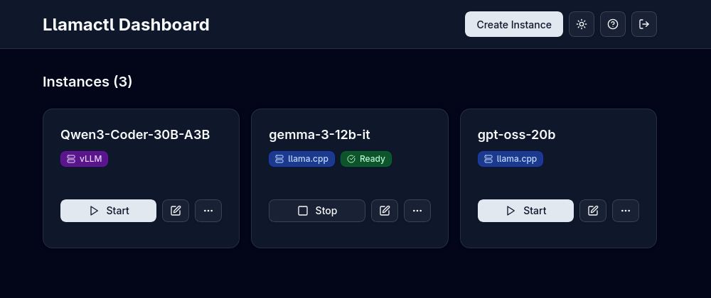

# Llamactl Documentation

Welcome to the Llamactl documentation!  

## What is Llamactl?

**{{HEADLINE}}**

## Features

{{FEATURES}}  

## Quick Links

- [Installation Guide](installation.md) - Get Llamactl up and running
- [Configuration Guide](configuration.md) - Detailed configuration options
- [Quick Start](quick-start.md) - Your first steps with Llamactl
- [Authentication](authentication.md) - API keys, permissions, and SSO login
- [Managing Instances](managing-instances.md) - Instance lifecycle management
- [Managing Models](managing-models.md) - Download and manage models from HuggingFace
- [Custom Backends](custom-backends.md) - Manage inference servers without native support
- [API Reference](api-reference.md) - Complete API documentation

## Getting Help

If you need help or have questions:

- Check the [Troubleshooting](troubleshooting.md) guide
- Visit the [GitHub repository](https://github.com/lordmathis/llamactl)
- Review the [Configuration Guide](configuration.md) for advanced settings

## License

MIT License - see the [LICENSE](https://github.com/lordmathis/llamactl/blob/main/LICENSE) file.
