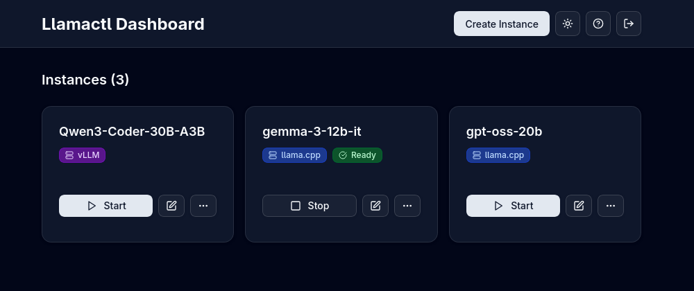

# Llamactl Documentation

Welcome to the Llamactl documentation! **Management server and proxy for multiple llama.cpp instances with OpenAI-compatible API routing.**

## What is Llamactl?

Llamactl is designed to simplify the deployment and management of llama-server instances. It provides a modern solution for running multiple large language models with centralized management.

## Features

🚀 **Multiple Model Serving**: Run different models simultaneously (7B for speed, 70B for quality)  
🔗 **OpenAI API Compatible**: Drop-in replacement - route requests by model name  
🌐 **Web Dashboard**: Modern React UI for visual management (unlike CLI-only tools)  
🔐 **API Key Authentication**: Separate keys for management vs inference access  
📊 **Instance Monitoring**: Health checks, auto-restart, log management  
⚡ **Smart Resource Management**: Idle timeout, LRU eviction, and configurable instance limits  
💡 **On-Demand Instance Start**: Automatically launch instances upon receiving OpenAI-compatible API requests  
💾 **State Persistence**: Ensure instances remain intact across server restarts  

## Quick Links

- [Installation Guide](getting-started/installation.md) - Get Llamactl up and running
- [Configuration Guide](getting-started/configuration.md) - Detailed configuration options
- [Quick Start](getting-started/quick-start.md) - Your first steps with Llamactl
- [Managing Instances](user-guide/managing-instances.md) - Instance lifecycle management
- [API Reference](user-guide/api-reference.md) - Complete API documentation

## Getting Help

If you need help or have questions:

- Check the [Troubleshooting](user-guide/troubleshooting.md) guide
- Visit the [GitHub repository](https://github.com/lordmathis/llamactl)
- Review the [Configuration Guide](getting-started/configuration.md) for advanced settings

## License

MIT License - see the [LICENSE](https://github.com/lordmathis/llamactl/blob/main/LICENSE) file.
