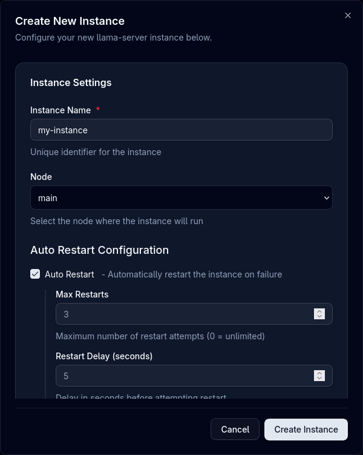

# Managing Instances

Learn how to effectively manage your llama.cpp, MLX, and vLLM instances with Llamactl through both the Web UI and API.

## Overview

Llamactl provides two ways to manage instances:

- **Web UI**: Accessible at `http://localhost:8080` with an intuitive dashboard
- **REST API**: Programmatic access for automation and integration


### Authentication

Llamactl uses a **Management API Key** to authenticate requests to the management API (creating, starting, stopping instances). All curl examples below use `<token>` as a placeholder - replace this with your actual Management API Key.

By default, authentication is required. If you don't configure a management API key in your configuration file, llamactl will auto-generate one and print it to the terminal on startup. See the [Configuration](configuration.md) guide for details.

For Web UI access:
1. Navigate to the web UI
2. Enter your Management API Key
3. Bearer token is stored for the session

### Theme Support

- Switch between light and dark themes
- Setting is remembered across sessions

## Instance Cards

Each instance is displayed as a card showing:

- **Instance name**
- **Health status badge** (unknown, ready, error, failed)
- **Action buttons** (start, stop, edit, logs, delete)

## Create Instance

**Via Web UI**



1. Click the **"Create Instance"** button on the dashboard
2. *Optional*: Click **"Import"** to load a previously exported configuration

**Instance Settings:**

3. Enter a unique **Instance Name** (required)
4. **Select Node**: Choose which node to deploy the instance to
5. Configure **Auto Restart** settings:
    - Enable automatic restart on failure
    - Set max restarts and delay between attempts
6. Configure basic instance options:
    - **Idle Timeout**: Minutes before stopping idle instance
    - **On Demand Start**: Start instance only when needed

**Backend Configuration:**

7. **Select Backend Type**:
    - **Llama Server**: For GGUF models using llama-server
    - **MLX LM**: For MLX-optimized models (macOS only)
    - **vLLM**: For distributed serving and high-throughput inference
8. *Optional*: Click **"Parse Command"** to import settings from an existing backend command
9. Configure **Execution Context**:
    - **Enable Docker**: Run backend in Docker container
    - **Command Override**: Custom path to backend executable
    - **Environment Variables**: Custom environment variables

!!! tip "Auto-Assignment"
    Llamactl automatically assigns ports from the configured port range (default: 8000-9000) and generates API keys if authentication is enabled. You typically don't need to manually specify these values.
  
10. Configure **Basic Backend Options** (varies by backend):
    - **llama.cpp**: Model path, threads, context size, GPU layers, etc.
    - **MLX**: Model identifier, temperature, max tokens, etc.
    - **vLLM**: Model identifier, tensor parallel size, GPU memory utilization, etc.
11. *Optional*: Expand **Advanced Backend Options** for additional settings
12. *Optional*: Add **Extra Args** as key-value pairs for custom command-line arguments
13. Click **"Create"** to save the instance  

**Via API**

```bash
# Create llama.cpp instance with local model file
curl -X POST http://localhost:8080/api/v1/instances/my-llama-instance \
  -H "Content-Type: application/json" \
  -H "Authorization: Bearer <token>" \
  -d '{
    "backend_type": "llama_cpp",
    "backend_options": {
      "model": "/path/to/model.gguf",
      "threads": 8,
      "ctx_size": 4096,
      "gpu_layers": 32,
      "flash_attn": "on"
    },
    "auto_restart": true,
    "max_restarts": 3,
    "docker_enabled": false,
    "command_override": "/opt/llama-server-dev",
    "nodes": ["main"]
  }'

# Create vLLM instance with environment variables
curl -X POST http://localhost:8080/api/v1/instances/my-vllm-instance \
  -H "Content-Type: application/json" \
  -H "Authorization: Bearer <token>" \
  -d '{
    "backend_type": "vllm",
    "backend_options": {
      "model": "microsoft/DialoGPT-medium",
      "tensor_parallel_size": 2,
      "gpu_memory_utilization": 0.9
    },
    "on_demand_start": true,
    "environment": {
      "CUDA_VISIBLE_DEVICES": "0,1"
    },
    "nodes": ["worker1", "worker2"]
  }'

# Create MLX instance (macOS only)
curl -X POST http://localhost:8080/api/v1/instances/my-mlx-instance \
  -H "Content-Type: application/json" \
  -H "Authorization: Bearer <token>" \
  -d '{
    "backend_type": "mlx_lm",
    "backend_options": {
      "model": "mlx-community/Mistral-7B-Instruct-v0.3-4bit",
      "temp": 0.7,
      "max_tokens": 2048
    },
    "nodes": ["main"]
  }'
```

## Start Instance

**Via Web UI**
1. Click the **"Start"** button on an instance card
2. Watch the status change to "Unknown"
3. Monitor progress in the logs
4. Instance status changes to "Ready" when ready

**Via API**
```bash
curl -X POST http://localhost:8080/api/v1/instances/{name}/start \
  -H "Authorization: Bearer <token>"
```

## Stop Instance

**Via Web UI**
1. Click the **"Stop"** button on an instance card
2. Instance gracefully shuts down

**Via API**
```bash
curl -X POST http://localhost:8080/api/v1/instances/{name}/stop \
  -H "Authorization: Bearer <token>"
```

## Edit Instance

**Via Web UI**
1. Click the **"Edit"** button on an instance card
2. Modify settings in the configuration dialog
3. Changes require instance restart to take effect
4. Click **"Update & Restart"** to apply changes

**Via API**
Modify instance settings:

```bash
curl -X PUT http://localhost:8080/api/v1/instances/{name} \
  -H "Content-Type: application/json" \
  -H "Authorization: Bearer <token>" \
  -d '{
    "backend_options": {
      "threads": 8,
      "context_size": 4096
    }
  }'
```

!!! note
    Configuration changes require restarting the instance to take effect.


## Export Instance

**Via Web UI**
1. Click the **"More actions"** button (three dots) on an instance card
2. Click **"Export"** to download the instance configuration as a JSON file

## View Logs

**Via Web UI**

1. Click the **"Logs"** button on any instance card
2. Real-time log viewer opens

**Via API**
Check instance status in real-time:

```bash
# Get instance logs
curl http://localhost:8080/api/v1/instances/{name}/logs \
  -H "Authorization: Bearer <token>"
```

## Delete Instance

**Via Web UI**
1. Click the **"Delete"** button on an instance card
2. Only stopped instances can be deleted
3. Confirm deletion in the dialog

**Via API**
```bash
curl -X DELETE http://localhost:8080/api/v1/instances/{name} \
  -H "Authorization: Bearer <token>"
```

## Instance Proxy

Llamactl proxies all requests to the underlying backend instances (llama-server, MLX, or vLLM).

```bash
# Proxy requests to the instance
curl http://localhost:8080/api/v1/instances/{name}/proxy/ \
  -H "Authorization: Bearer <token>"
```

All backends provide OpenAI-compatible endpoints. Check the respective documentation:
- [llama-server docs](https://github.com/ggml-org/llama.cpp/blob/master/tools/server/README.md)
- [MLX-LM docs](https://github.com/ml-explore/mlx-lm/blob/main/mlx_lm/SERVER.md)
- [vLLM docs](https://docs.vllm.ai/en/latest/)

### Instance Health

**Via Web UI**

1. The health status badge is displayed on each instance card

**Via API**

Check the health status of your instances:

```bash
curl http://localhost:8080/api/v1/instances/{name}/proxy/health \
  -H "Authorization: Bearer <token>"
```

