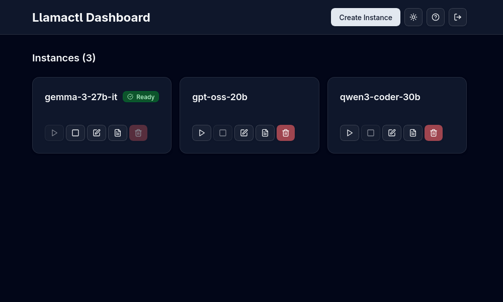
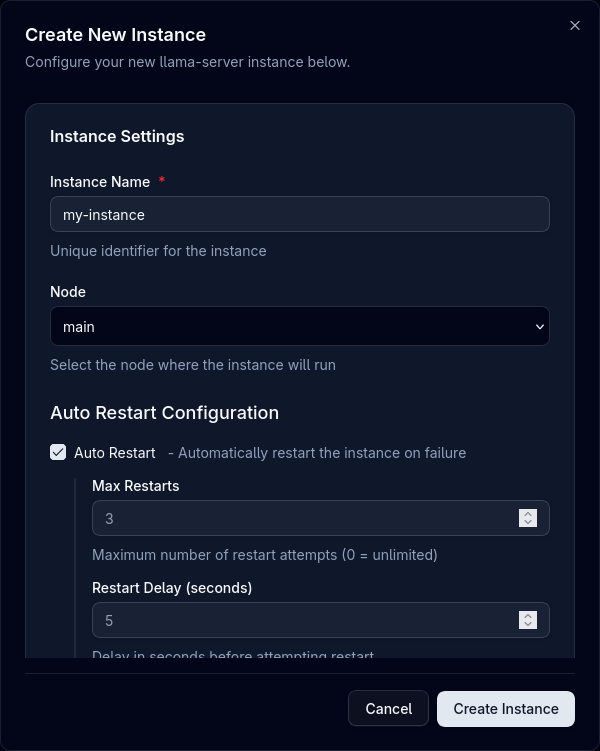

# Managing Instances

Learn how to effectively manage your llama.cpp, MLX, and vLLM instances with Llamactl through both the Web UI and API.

## Overview

Llamactl provides two ways to manage instances:

- **Web UI**: Accessible at `http://localhost:8080` with an intuitive dashboard
- **REST API**: Programmatic access for automation and integration



### Authentication

If authentication is enabled:
1. Navigate to the web UI
2. Enter your credentials
3. Bearer token is stored for the session

### Theme Support

- Switch between light and dark themes
- Setting is remembered across sessions

## Instance Cards

Each instance is displayed as a card showing:

- **Instance name**
- **Health status badge** (unknown, ready, error, failed)
- **Action buttons** (start, stop, edit, logs, delete)

## Create Instance

### Via Web UI



1. Click the **"Create Instance"** button on the dashboard
2. Enter a unique **Name** for your instance (only required field)
3. **Choose Backend Type**:
    - **llama.cpp**: For GGUF models using llama-server
    - **MLX**: For MLX-optimized models (macOS only)
    - **vLLM**: For distributed serving and high-throughput inference
4. Configure model source:
    - **For llama.cpp**: GGUF model path or HuggingFace repo
    - **For MLX**: MLX model path or identifier (e.g., `mlx-community/Mistral-7B-Instruct-v0.3-4bit`)
    - **For vLLM**: HuggingFace model identifier (e.g., `microsoft/DialoGPT-medium`)
5. Configure optional instance management settings:
    - **Auto Restart**: Automatically restart instance on failure
    - **Max Restarts**: Maximum number of restart attempts
    - **Restart Delay**: Delay in seconds between restart attempts
    - **On Demand Start**: Start instance when receiving a request to the OpenAI compatible endpoint
    - **Idle Timeout**: Minutes before stopping idle instance (set to 0 to disable)
6. Configure backend-specific options:
    - **llama.cpp**: Threads, context size, GPU layers, port, etc.
    - **MLX**: Temperature, top-p, adapter path, Python environment, etc.
    - **vLLM**: Tensor parallel size, GPU memory utilization, quantization, etc.
7. Click **"Create"** to save the instance  

### Via API

```bash
# Create llama.cpp instance with local model file
curl -X POST http://localhost:8080/api/instances/my-llama-instance \
  -H "Content-Type: application/json" \
  -d '{
    "backend_type": "llama_cpp",
    "backend_options": {
      "model": "/path/to/model.gguf",
      "threads": 8,
      "ctx_size": 4096,
      "gpu_layers": 32
    }
  }'

# Create MLX instance (macOS only)
curl -X POST http://localhost:8080/api/instances/my-mlx-instance \
  -H "Content-Type: application/json" \
  -d '{
    "backend_type": "mlx_lm",
    "backend_options": {
      "model": "mlx-community/Mistral-7B-Instruct-v0.3-4bit",
      "temp": 0.7,
      "top_p": 0.9,
      "max_tokens": 2048
    },
    "auto_restart": true,
    "max_restarts": 3
  }'

# Create vLLM instance
curl -X POST http://localhost:8080/api/instances/my-vllm-instance \
  -H "Content-Type: application/json" \
  -d '{
    "backend_type": "vllm",
    "backend_options": {
      "model": "microsoft/DialoGPT-medium",
      "tensor_parallel_size": 2,
      "gpu_memory_utilization": 0.9
    },
    "auto_restart": true,
    "on_demand_start": true
  }'

# Create llama.cpp instance with HuggingFace model
curl -X POST http://localhost:8080/api/instances/gemma-3-27b \
  -H "Content-Type: application/json" \
  -d '{
    "backend_type": "llama_cpp",
    "backend_options": {
      "hf_repo": "unsloth/gemma-3-27b-it-GGUF",
      "hf_file": "gemma-3-27b-it-GGUF.gguf",
      "gpu_layers": 32
    }
  }'
```

## Start Instance

### Via Web UI
1. Click the **"Start"** button on an instance card
2. Watch the status change to "Unknown"
3. Monitor progress in the logs
4. Instance status changes to "Ready" when ready

### Via API
```bash
curl -X POST http://localhost:8080/api/instances/{name}/start
```

## Stop Instance

### Via Web UI
1. Click the **"Stop"** button on an instance card
2. Instance gracefully shuts down

### Via API
```bash
curl -X POST http://localhost:8080/api/instances/{name}/stop
```

## Edit Instance

### Via Web UI
1. Click the **"Edit"** button on an instance card
2. Modify settings in the configuration dialog
3. Changes require instance restart to take effect
4. Click **"Update & Restart"** to apply changes

### Via API
Modify instance settings:

```bash
curl -X PUT http://localhost:8080/api/instances/{name} \
  -H "Content-Type: application/json" \
  -d '{
    "backend_options": {
      "threads": 8,
      "context_size": 4096
    }
  }'
```

!!! note
    Configuration changes require restarting the instance to take effect.


## View Logs

### Via Web UI

1. Click the **"Logs"** button on any instance card
2. Real-time log viewer opens

### Via API
Check instance status in real-time:

```bash
# Get instance details
curl http://localhost:8080/api/instances/{name}/logs
```

## Delete Instance

### Via Web UI
1. Click the **"Delete"** button on an instance card
2. Only stopped instances can be deleted
3. Confirm deletion in the dialog

### Via API
```bash
curl -X DELETE http://localhost:8080/api/instances/{name}
```

## Instance Proxy

Llamactl proxies all requests to the underlying backend instances (llama-server, MLX, or vLLM).

```bash
# Get instance details
curl http://localhost:8080/api/instances/{name}/proxy/
```

All backends provide OpenAI-compatible endpoints. Check the respective documentation:
- [llama-server docs](https://github.com/ggml-org/llama.cpp/blob/master/tools/server/README.md)
- [MLX-LM docs](https://github.com/ml-explore/mlx-lm/blob/main/mlx_lm/SERVER.md)
- [vLLM docs](https://docs.vllm.ai/en/latest/)

### Instance Health

#### Via Web UI

1. The health status badge is displayed on each instance card

#### Via API

Check the health status of your instances:

```bash
curl http://localhost:8080/api/instances/{name}/proxy/health
```
